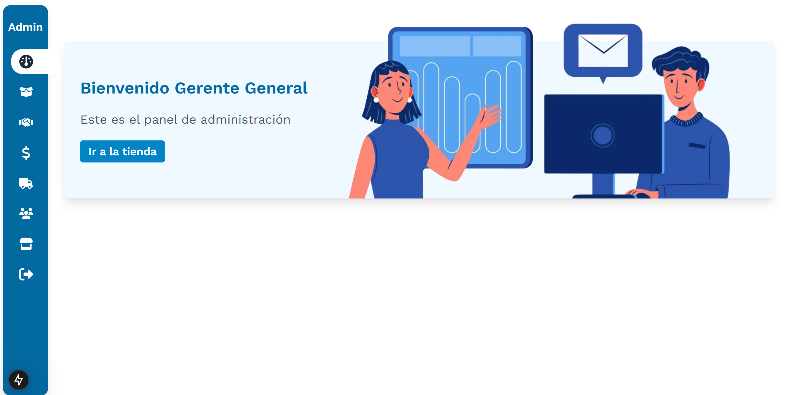

# La Veguita

La Veguita es una aplicación web diseñada para centralizar y optimizar la gestión de ventas, inventarios, proveedores, y transporte en La Veguita Click, una empresa de alimentos orgánicos. Esta solución integra un frontend y un backend como submódulos para separar y organizar las responsabilidades del sistema.

# Submódulos
## Frontend

Desarrollado con Next.js, el frontend ofrece:

- Una experiencia tipo e-commerce para los clientes, incluyendo un carrito de compras.
- Una vista administrativa para la gestión de productos, ventas, proveedores, y logística de transporte.

## Backend

Construido con Django, el backend maneja:

- La base de datos, estructurada con MySQL.
- Roles de usuario y control de acceso (clientes y administradores).
- La lógica de negocio necesaria para los flujos de ventas, inventarios y transporte.

## Capturas 

